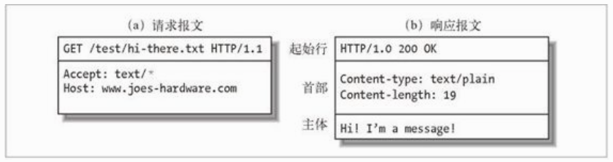

# HTTP协议

# HTTP报文
有两种类型的报文: 请求报文(request message) 响应报文(response message)

报文包含以下三部分:
- 起始行
- 首部字段
- 主体

## 请求报文
```
<method><request-URL><version>

<headers>

<entity-body>
```

## 响应报文
```
<version><status-code><reason-phrase>

<headers>

<entity-body>
```

## 简要概述

- 方法(method): GET POST HEAD等
- 请求URL(request-URL): URL路径
- 版本(version): 报文使用的HTTP版本号  HTTP/<major>.<minor>
- 状态码(status-code): 三位数字, 描述了请求过程中发生的情况.
- 原因短语(reason-phrase): “数字状态码的可读版本，包含行终止序列之前的所有文本”
- 首部(headers): 首部, 每个报文可以有多个, 用:将name和value隔开, 用一个空行结束(CRLF)
- 实体的主体部分(entity-body): 由任意数据组成的数据块. 不是所有的报文都包含.




