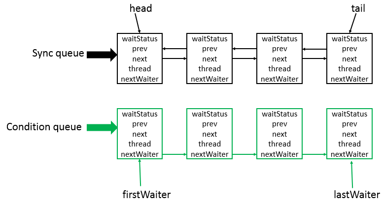

# 简介
在锁框架中，AbstractQueuedSynchronizer抽象类可以毫不夸张的说，占据着核心地位，它提供了一个基于FIFO队列，可以用于构建锁或者其他相关同步装置的基础框架。所以很有必要好好分析。

转载自 http://www.cnblogs.com/leesf456/p/5350186.html

# AbstractQueuedSynchronizer数据结构
分析类，首先就要分析底层采用了何种数据结构，抓住核心点进行分析，经过分析可知，AbstractQueuedSynchronizer类的数据结构如下



说明：AbstractQueuedSynchronizer类底层的数据结构是使用双向链表，是队列的一种实现，故也可看成是队列，其中Sync queue，即同步队列，是双向链表，包括head结点和tail结点，head结点主要用作后续的调度。而Condition queue不是必须的，其是一个单向链表，只有当使用Condition时，才会存在此单向链表。并且可能会有多个Condition queue。

# AbstractQueuedSynchronizer源码分析

## 类的继承关系
```java
public abstract class AbstractQueuedSynchronizer
    extends AbstractOwnableSynchronizer
    implements java.io.Serializable
```
　　说明：从类继承关系可知，AbstractQueuedSynchronizer继承自AbstractOwnableSynchronizer抽象类，并且实现了Serializable接口，可以进行序列化。而AbstractOwnableSynchronizer抽象类的源码如下　

```java
public abstract class AbstractOwnableSynchronizer
    implements java.io.Serializable {
    
    // 版本序列号
    private static final long serialVersionUID = 3737899427754241961L;
    // 构造函数
    protected AbstractOwnableSynchronizer() { }
    // 独占模式下的线程
    private transient Thread exclusiveOwnerThread;
    
    // 设置独占线程 
    protected final void setExclusiveOwnerThread(Thread thread) {
        exclusiveOwnerThread = thread;
    }
    
    // 获取独占线程 
    protected final Thread getExclusiveOwnerThread() {
        return exclusiveOwnerThread;
    }
}
```