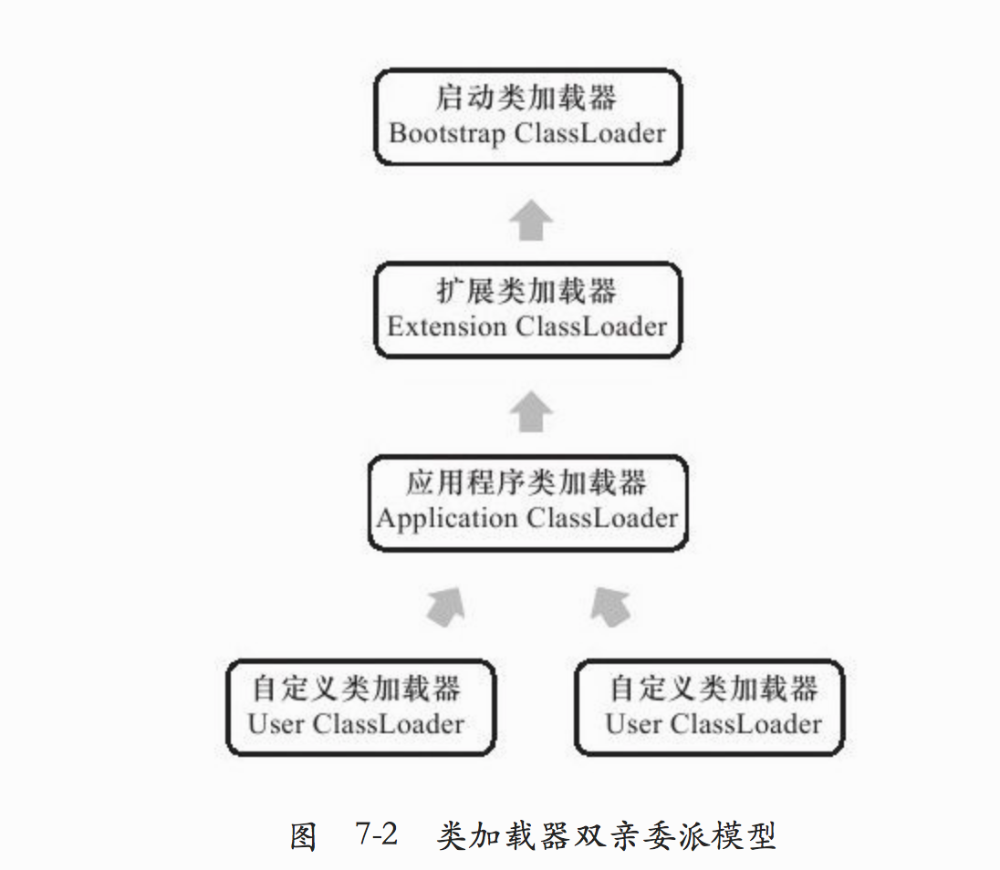

# Java对象初始化顺序
属性、方法、构造方法和自由块都是类中的成员，在创建类的对象时，类中各成员的执行顺序：
1. 父类静态成员和静态初始化快，按在代码中出现的顺序依次执行。
2. 子类静态成员和静态初始化块，按在代码中出现的顺序依次执行。
3. 父类的实例成员和实例初始化块，按在代码中出现的顺序依次执行。
4. 执行父类的构造方法。
5. 子类实例成员和实例初始化块，按在代码中出现的顺序依次执行。
6. 执行子类的构造方法。

# 面试问题

Java的虚拟机的面试内容主要包括三部分：
### GC、类加载机制，以及内存。　　
一个GC部分简单的连环炮。面试官可以先问你什么时候一个对象会被GC？　　

接着继续问你为什么要在这种时候对象才会被GC？　
　
接着继续问你GC策略都有哪些分类？　　

你如果说出来了，继续问你这些策略分别都有什么优劣势？都适用于什么场景？

你继续说出来了以后，给你举个实际的场景，让你选择一个GC策略？　　

你如果选出来了，继续问你，为什么要选择这个策略？

### 下面是关于类加载机制的简单连环炮。首先肯定是先问你Java的类加载器都有哪些？　　

回答了这些以后，可能会问你每个类加载器都加载哪些类？　　

说完以后，可能会问你这些类加载之间的父子关系是怎样的？　　

你在回答的时候可能会提到双亲委派模型，那么可以继续问你什么是双亲委派模型？　　

你解释完了以后，可能会继续问你，为什么Java的类加载器要使用双亲委派模型？　　

你回答完以后，可能会继续问你如何自定义自己的类加载器，自己的类加载器和Java自带的类加载器关系如何处理？

### 再来一个关于内存的连环炮。
首先肯定就是问你JVM内存分为哪几部分，这些部分分别都存储哪些数据？　　

然后继续问你一个对象从创建到销毁都是怎么在这些部分里存活和转移的？　　

接着可能会问你，内存的哪些部分会参与GC的回收？　　

完事以后，可能还会问你Java的内存模型是怎么设计的？　　

你回答了以后，还会继续问你为什么要这么设计？　　

问完以后，还可能会让你结合内存模型的设计谈谈volatile关键字的作用？　　

你在谈的时候，肯定会提到可见性，那么接着可见性这三个字，还可以继续问你并发的内容。

#### 类加载器
双亲委派模型

启动类加载器 Bootstrap ClassLoader 由C++写的, 虚拟机的一部分

其他的类加载器都由Java编写, 独立于虚拟机外, 全部继承抽象类java.lang.ClassLoader

#### 系统提供的三个类加载器:
1. 启动类加载器 Bootstrap ClassLoader : 将<JAVA_HOME>/lib下的库都加载到虚拟机中(按照文件名识别, 如果不是虚拟机需要的不会被加载), 或者, 启动类加载器不会被Java程序直接引用, 

2. 扩展类加载器 Extension ClassLoader: 加载<JAVA_HOME>/lib/ext下的类,  被java.ext.dirs系统变量指定的路径下的类, 开发者可以直接使用扩展类加载器

3. 应用类加载器 Application ClassLoader: 负责加载用户路径(ClassPath)上指定的类, 可以自定义类加载器. 如果应用程序没有自定义过类加载器, 那么一般用的就是这个加载器.

#### 双亲委派模型(Parents Delegation Model)

#### 加载过程
1. 加载
通过类名获得二进制字节流, 转化为方法区的运行时数据结构, 生成一个代表这个类的Class结构, 作为方法区访问这个类的各种数据结构的入口

2. 验证
- 文件格式验证: 文件格式验证(版本号, 字节流编码等), 元数据验证(类的元数据进行校验 继承关系, 属性, 方法等), 字节码验证(判断语义是否合法等), 符号引用验证(是否能找到符号对应的类, 这个类的方法, 属性等是否能被当前类引用等等)

3. 准备
为类变量(static变量)分配内存并设置初始值, 是0, 不是代码中写的数值.

但是有些ConstantsValue常量, 直接初始化为指定值
4. 解析
将常量池中的符号引用替换为直接引用

- 符号引用(Symbolic References)以一组符号来描述所引用的目标，符号可以是任何形式的字面量，只要使用时能无歧义地定位到目标即可

- 直接引用(Direct References) 可以直接指向目标的指针, 相对偏移量, 或是一个能间接定位到目标的指针

5. 初始化
在初始化阶段, 才开始真正执行Java字节码

# 设计模式
- 工厂模式  
-  单例模式  double check  内部静态类
- 代理模式  
- 建造者模式  复杂对象新建
- 策略模式  
 测略模式的决定权在用户，系统本身提供不同算法的实现，新增或者删除算法，对各种算法做封装。因此，策略模式多用在算法决策系统中，外部用户只需要决定用哪个算法即可。
- 模板方法模式

    解释一下模板方法模式，就是指：一个抽象类中，有一个主方法，再定义1...n个方法，可以是抽象的，也可以是实际的方法，定义一个类，继承该抽象类，重写抽象方法，通过调用抽象类，实现对子类的调用，先看个关系图：

- 适配器模式
- 责任链模式
- 观察者模式
# java并发相关库

# 线程

# kafka
# servlet

