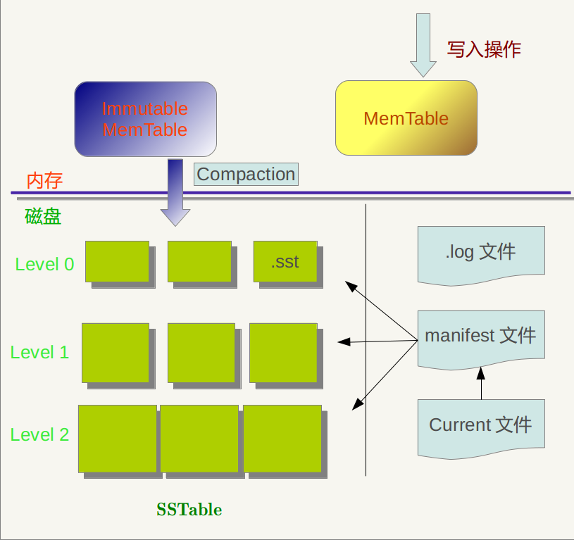
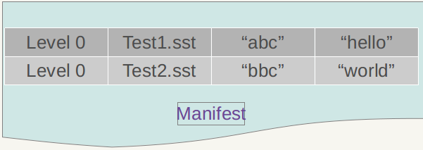

# 参考文档
[原文](http://blog.csdn.net/tenfyguo/article/details/8454809)

# 整体架构

如图,主要包含六部分文件:
- 内存中:
    - MemTable
    - Immutable MemTable
- 磁盘中:
    - Current文件
    - Manifest文件
    - log文件
    - SSTable文件

当应用写入一条Key:Value数据时,LevelDB会先往log文件中写,成功后,再将记录插入到MEMTable中.这样基本就完成了写入操作.一次写入操作只涉及一次磁盘顺序写和一次内存写入,这就是LevelDB写入速度极快的原因.

Log文件的作用:防止系统崩溃而造成数据丢失.系统奔溃时.只需要将Log文件中的数据持久化到内存中即可.

当Memtable插入的数据占用内存到达一定界限后, 会将内存中的数据导出到磁盘中来进行持久化, LevelDB会生成新的MemTable和Log文件, 原来的MEMTable会转化为Immutable MemTable.
Immutable MemTable只读,不可进行写入和更改. 新数据会被记录到新的Log文件和新的MemTable中, 而后台调度会将Immutable MemTable的数据导出到磁盘, 形成一个新的SSTable文件(*.sst).

SSTable就是内存中的数据不断导出并进行Compaction操作后形成的. SSTable的所有文件是一种层级结构,第一层为level 0, 第二层为level 1等.
SSTable中的Key是有序的,文件中的数据按照Key的大小顺序进行排序. 各个层级的SSTable都是如此.但是level0的SSTable和其他层级的SSTable有所不同: 在level0的.sst文件中, 可能会存在Key重叠的情况,比如A中Key的范围{bar, car}, B中Key的范围{bar1, caa}, 很可能两个文件都存在Key='bar2'的数据. 这种现象在其他level的SSTable中不会出现.

Manifest文件用来记录SSTable各个文件的管理信息, 比如数据哪个level, 文件名叫啥, 最小Key和最大Key的值等,Manifest文件结构示意图:

Current文件: 记录当前Manifest文件名. 在LevelDB运行过程中, 随着Compaction的进行, SSTable文件结构会发生变化, 会有新的文件产生, 老的文件废弃, Manifest会反映出这种变化, 此时往往会生成新的Manifest来记载这种变化. Current的目的就是用来指出哪个Manifest文件才是我们需要关心的文件.

