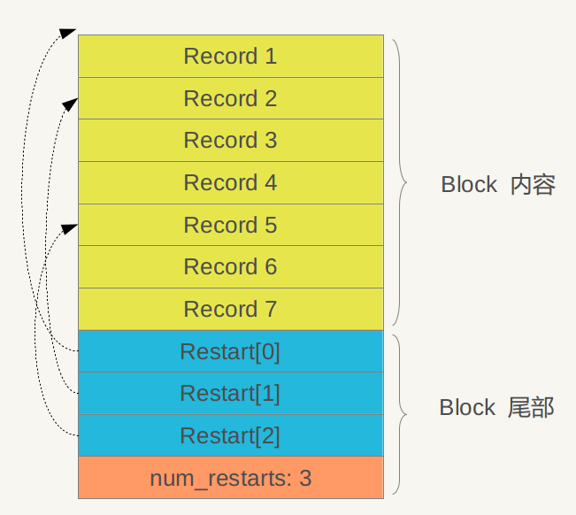

# 参考文档
[原文](http://blog.csdn.net/tenfyguo/article/details/8454809)

# 整体架构

如图,主要包含六部分文件:
- 内存中:
    - MemTable
    - Immutable MemTable
- 磁盘中:
    - Current文件
    - Manifest文件
    - log文件
    - SSTable文件

当应用写入一条Key:Value数据时,LevelDB会先往log文件中写,成功后,再将记录插入到MEMTable中.这样基本就完成了写入操作.一次写入操作只涉及一次磁盘顺序写和一次内存写入,这就是LevelDB写入速度极快的原因.

Log文件的作用:防止系统崩溃而造成数据丢失.系统奔溃时.只需要将Log文件中的数据持久化到内存中即可.

当Memtable插入的数据占用内存到达一定界限后, 会将内存中的数据导出到磁盘中来进行持久化, LevelDB会生成新的MemTable和Log文件, 原来的MEMTable会转化为Immutable MemTable.
Immutable MemTable只读,不可进行写入和更改. 新数据会被记录到新的Log文件和新的MemTable中, 而后台调度会将Immutable MemTable的数据导出到磁盘, 形成一个新的SSTable文件(*.sst).

SSTable就是内存中的数据不断导出并进行Compaction操作后形成的. SSTable的所有文件是一种层级结构,第一层为level 0, 第二层为level 1等.
SSTable中的Key是有序的,文件中的数据按照Key的大小顺序进行排序. 各个层级的SSTable都是如此.但是level0的SSTable和其他层级的SSTable有所不同: 在level0的.sst文件中, 可能会存在Key重叠的情况,比如A中Key的范围{bar, car}, B中Key的范围{bar1, caa}, 很可能两个文件都存在Key='bar2'的数据. 这种现象在其他level的SSTable中不会出现.

Manifest文件用来记录SSTable各个文件的管理信息, 比如数据哪个level, 文件名叫啥, 最小Key和最大Key的值等,Manifest文件结构示意图:

Current文件: 记录当前Manifest文件名. 在LevelDB运行过程中, 随着Compaction的进行, SSTable文件结构会发生变化, 会有新的文件产生, 老的文件废弃, Manifest会反映出这种变化, 此时往往会生成新的Manifest来记载这种变化. Current的目的就是用来指出哪个Manifest文件才是我们需要关心的文件.

# log文件
log文件的布局:

LevelDB将log文件切分为32K的Block, 每次读取以一个Block作为一个单位, 上图中一个log文件由三个Block组成, 从屋里布局上来看, log文件就是由多个连续的Block构成的. 

应用中是看不到这些Block的,只能看到Key:Value对, 在LevelDB中,将Key:Value对看做一条记录, 另外在这个数据前增加一个记录头, 用来记载一些管理信息.

记录头包含三个字段:
- CheckSum 是对"类型"和"数据"字段"的校验码, 当LevelDB读取数据时会对数据进行校验, 如果和CheckSum相同, 则说明数据完整, 没有遭到破坏. 
- "记录长度" 记载了数据的大小
- "数据" 则是上面将的Key:Value对.
- "类型"字段指出了每条记录的逻辑结构和log文件物理分块结构之间的关系, 具体而言,主要有以下四种类型:FULL/FIFST/MIDDLE/LAST.

如果记录类型是FULL, 代表了当前记录内容完整的存储在一个Block块中. 如果被分隔开,FIRST表示第一块数据LAST表示最后一块数据,中间的数据用MIDDLE表示.

LevelDB一次物理读取为一个Block, 然后将类型情况拼接处逻辑记录.

# SSTable文件
LevelDB中有不同层级的SSTable, SSTable将文件划分为固定大小的物理存储块, 内部数据按照Key的数据排序.  .sst文件结构入下图:

一个.sst文件被划分为固定大小的存储块, 每个Block分为三个部分:
- 数据存储Block,用来存储数据.
- Type区 用于标识数据存储区是否使用了数据加锁算法(Snappy算法)
- CRC 数据校验码, 用于判断数据在生成和传输时是否出错.

.sst文件的逻辑布局(每个数据块存储哪些内容, 包含哪些结构):

.sst文件被划分为两大区域:
- 数据存储区(Data Block) 用于存放实际的Key:Value数据
- 数据管理区 提供一些索引指针等管理数据, 目的是为了更快速便捷的查找相应的记录.

.sst文件的前面若干块实际存储KV数据, 后边数据管理区存储管理数据.

管理数据区又分为四种不同的类型:
- Meta Block
- Matablock Index(索引)
- Index block(数据索引块)
- Footer (文件尾部块)

LevelDB 1.2中对Meta Block并没有使用, 只保留了接口, 估计会在后续版本中加入内容.

看一下数据索引区(Index Block)的内部结构:

数据索引区是对Data Block中的数据建立的索引, 每条索引包含三个内容:
- 第一个字段记载大于等于数据块i中最大的Key值的那个Key
- 第二个字段指出数据块 i 在.sst文件中的起始位置
- 第三个字段指出Data Block i 的大小(有时候会有数据压缩)

索引里保存的Key未必是某条记录的Key. 上图中, Data Block i的索引Key的大小可以介于"world"和"www"之间,比如"worle". 也可以直接为"world".

Footer(文件末尾块)的内部结构:

metaindex_handle指出了Metablock Index的起始位置和大小

index_handle指出了Index Block的起始地址和大小.

这两个字段是为了正确读出索引的地址而设立的. 后面跟着一个填充区和魔数.

而数据存储区(Data Block)的数据部分内部布局如下图:

数据存储区内部也分为两部分: 前面是按照Key进行排序的数值记录, 在Block尾部则是有一些"重启点"(Restart Point), 指向Block内容中的一些记录的位置.

"重启点"的作用: 在Block内部Key是按照大小排序的, 相邻的两个Key很有可能Key存在部分重叠. 比如 key i="the car", key i+1="the color", Key i+1可以只存储olor部分, 两者的共同部分(the c)可以从Key i中获得. 通过重用Key的重复部分,减少存储开销. "重启点"的意思是: 从这条记录开始, 不在采用只记载不同Key部分, 而是重新记录整个Key值.

在Block内容区,数据结构是这样的:

包含五个字段:
- Key共享长度
- Key非共享长度
- Value长度
- Key非共享内容
- Value内容

# Memtable
Immutable Memtable和MemTable在结构上完全一致, 不过Immutable MemTable只允许读取. 当MemTable中写入的数据打到一个阈值后, 会自动转换为Immutable MemTable, 等待被dump到磁盘中. 

MemTable提供了数据写入/删除/读取的接口, 实际上数据并不会被删除, 而是会被打上一个删除标记, 是Lazy的, 会在稍后的Compaction中去掉这条记录. 

MemTable中的数据也是按照Key来排序的, 新数据插入时需要插入到特定位置来保证Key的有序性, MemTable只是个接口类, 其具体实现是一个SkipList

# 写入与删除记录

写入操作:
1. 以顺序写的方式追加到log文件尾部.
2. 如果log写入成功, 那么把记录插入到MemTable中.

# 读取记录

示意图:

1. 首先去MemTable中查找, 如果找到立即返回, 否则继续.
2. 去Immutable MemTable中查找, 如果找到立即返回, 否则继续.
3. 去SSTable中查找. 由于SSTable分为多层, 逐层查找, 在某一层找到时立即返回, 否则去下一层查找.

原因: 数据新鲜度(越大表示越新): MemTable > Immutable MemTable > SSTable

# Compaction操作
对已有记录进行压缩, 删除掉一些不再有效的数据. 减少数据规模.

有三种Compaction操作:
- minor Compaction: 把Immutable MemTable中的数据导出到SSTable中.
- major Compaction: 合并不同层级的SSTable
- full Compaction: 合并所有层级的SSTable

## minor Compaction
示意图:

Level 0 的SSTable是直接由Immutable MemTable转化的, 所以在Level 0的不同.sst文件中可能会存在Key重复的情况. 

当level 0中的SSTable数量达到一定程度后, 先选中一块SSTable, 然后找出其他SSTable中与该块中Key重叠的部分, 将数据合并到Level 1 的SSTable中.

而在其他level中, 只需要找出其中的一个SSTable与下一级的SSTable进行合并. 

如何选定这个需要与下级进行合并的文件呢? 轮流来. 如果第一次是文件A, 那么下次合并就合并紧挨着A的B. 这样可以保证所有文件都可以被合并到下级的SSTable中.

找到对应的SSTable后,与下一级中Key重叠的SSTable进行合并.

Major Compaction 多路归并排序:

首先对选中的下一级的多个SSTable进行多路归并排序, 之后判断这个Key是否需要保存, 如果没有就直接抛弃掉, 如果需要保存, 就会被保存到Level n+1层中一个新生成的SSTable中去. 数据处理完后, 生成一系列新的SSTable, 将之前参与合并的SSTable都删除掉, 完成合并.

# Cache
LevelDB中引入了两种不同的Cache:
- Table Cache
- Block Cache

其中Block Cache是可以选的, 可以在配置中选择是否打开.

## Table Cache

在Table Cache中, Key是SSTable的文件名, Value包含两部分, 一个是指向磁盘打开的SSTable的文件指针, 为了方便读取. 另一个是指向内存中这个SSTable对应的Table结构指针, Table结构指针在内存中保存了SSTable的Index内容以及用来指示Block Cache用的cache id, 以及一些其他内容

## Block Cache

Block Cache是为了加快这一过程. Key是cache id + block在文件中的起始位置block_offset. Value则是这个Block的内容.

如果LevelDB发现Block在Block Cache中, 就会直接从Cache中读取数据. 如果按照Key进行顺序读, 速度还是很快的, 如果随机读的话可能速度会慢些.

#Version VersionSet VersionEdit
Version 保存了当前磁盘以及内存中所有文件信息, 一般只有一个Version叫"current" Version. 

LevelDB还保存了一系列历史版本,作用:

当一个Iterator创建后, Iterator就引用到current Version(当前版本), 只要Iterator不被delete, 那么这个版本就会一直存在着. 这意味这如果你用完一个Iterator, 应该立即将其删除. 

当进行一个Compaction, LevelDB会创建一个新的版本, 原来的版本就变为历史版本, 

VersionSet 是所有Version的集合, 管理着所有版本.

VersionEdit 表示Version之间的变化, 相当于delta增量, 表示增加了多少文件, 删除了多少文件 Version0 +VersionEdit-->Version1

VersionEdit会保存到Manifest文件中, 当数据恢复时就会从Manifest中读出来重建数据.

