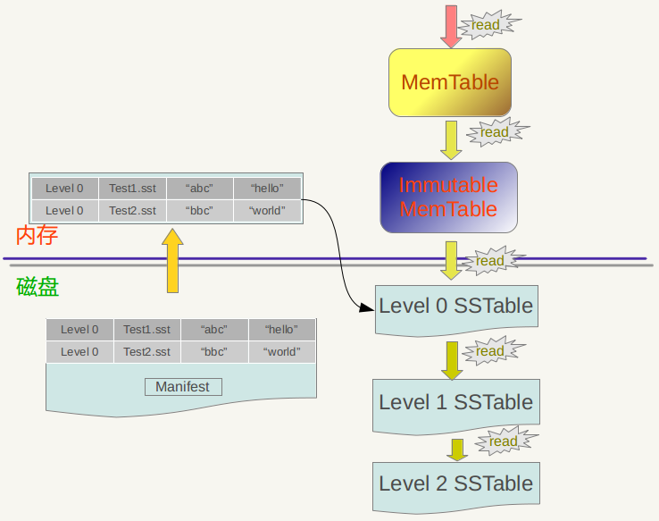
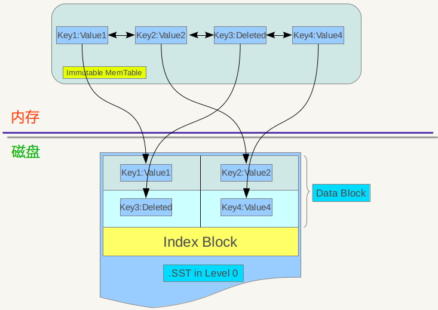
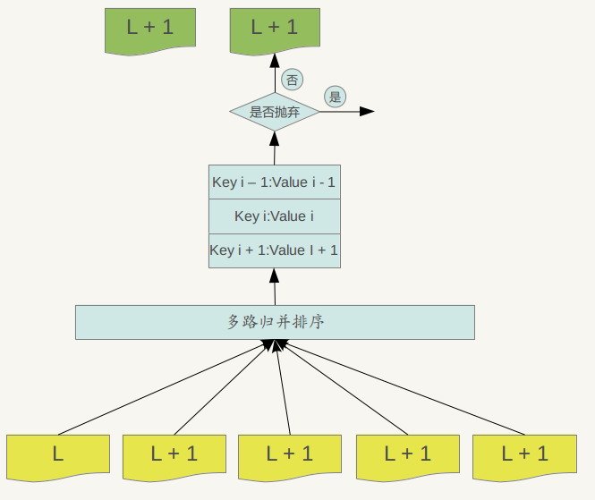

# 读取数据.

LevelDb是针对大规模Key/Value数据的单机存储库，从应用的角度来看，LevelDb就是一个存储工具。而作为称职的存储工具，常见的调用接口无非是新增KV，删除KV，读取KV，更新Key对应的Value值这么几种操作。LevelDb的接口没有直接支持更新操作的接口，如果需要更新某个Key的Value,你可以选择直接生猛地插入新的KV，保持Key相同，这样系统内的key对应的value就会被更新；或者你可以先删除旧的KV， 之后再插入新的KV，这样比较委婉地完成KV的更新操作。

假设应用提交一个Key值，下面我们看看LevelDb是如何从存储的数据中读出其对应的Value值的。图7-1是LevelDb读取过程的整体示意图。

> LevelDb首先会去查看内存中的Memtable，如果Memtable中包含key及其对应的value，则返回value值即可；如果在Memtable没有读到key，则接下来到同样处于内存中的Immutable Memtable中去读取，类似地，如果读到就返回，若是没有读到,那么只能万般无奈下从磁盘中的大量SSTable文件中查找。因为SSTable数量较多，而且分成多个Level，所以在SSTable中读数据是相当蜿蜒曲折的一段旅程。总的读取原则是这样的：首先从属于level 0的文件中查找，如果找到则返回对应的value值，如果没有找到那么到level 1中的文件中去找，如此循环往复，直到在某层SSTable文件中找到这个key对应的value为止（或者查到最高level，查找失败，说明整个系统中不存在这个Key)。

 > 那么为什么是从Memtable到Immutable Memtable，再从Immutable Memtable到文件，而文件中为何是从低level到高level这么一个查询路径呢？道理何在？之所以选择这么个查询路径，是因为从信息的更新时间来说，很明显Memtable存储的是最新鲜的KV对；Immutable Memtable中存储的KV数据对的新鲜程度次之；而所有SSTable文件中的KV数据新鲜程度一定不如内存中的Memtable和Immutable Memtable的。对于SSTable文件来说，如果同时在level L和Level L+1找到同一个key，level L的信息一定比level L+1的要新。也就是说，上面列出的查找路径就是按照数据新鲜程度排列出来的，越新鲜的越先查找。
 
 > 为啥要优先查找新鲜的数据呢？这个道理不言而喻，举个例子。比如我们先往levelDb里面插入一条数据 {key="www.samecity.com"  value="我们"},过了几天，samecity网站改名为：69同城，此时我们插入数据{key="www.samecity.com"  value="69同城"}，同样的key,不同的value；逻辑上理解好像levelDb中只有一个存储记录，即第二个记录，但是在levelDb中很可能存在两条记录，即上面的两个记录都在levelDb中存储了，此时如果用户查询key="www.samecity.com",我们当然希望找到最新的更新记录，也就是第二个记录返回，这就是为何要优先查找新鲜数据的原因。

>  前文有讲：对于SSTable文件来说，如果同时在level L和Level L+1找到同一个key，level L的信息一定比level L+1的要新。这是一个结论，理论上需要一个证明过程，否则会招致如下的问题：为神马呢？从道理上讲呢，很明白：因为Level L+1的数据不是从石头缝里蹦出来的，也不是做梦梦到的，那它是从哪里来的？Level L+1的数据是从Level L 经过Compaction后得到的（如果您不知道什么是Compaction，那么........也许以后会知道的），也就是说，您看到的现在的Level L+1层的SSTable数据是从原来的Level L中来的，现在的Level L比原来的Level L数据要新鲜，所以可证，现在的Level L比现在的Level L+1的数据要新鲜。

>  SSTable文件很多，如何快速地找到key对应的value值？在LevelDb中，level 0一直都爱搞特殊化，在level 0和其它level中查找某个key的过程是不一样的。因为level 0下的不同文件可能key的范围有重叠，某个要查询的key有可能多个文件都包含，这样的话LevelDb的策略是先找出level 0中哪些文件包含这个key（manifest文件中记载了level和对应的文件及文件里key的范围信息，LevelDb在内存中保留这种映射表）， 之后按照文件的新鲜程度排序，新的文件排在前面，之后依次查找，读出key对应的value。而如果是非level 0的话，因为这个level的文件之间key是不重叠的，所以只从一个文件就可以找到key对应的value。

>  最后一个问题,如果给定一个要查询的key和某个key range包含这个key的SSTable文件，那么levelDb是如何进行具体查找过程的呢？levelDb一般会先在内存中的Cache中查找是否包含这个文件的缓存记录，如果包含，则从缓存中读取；如果不包含，则打开SSTable文件，同时将这个文件的索引部分加载到内存中并放入Cache中。 这样Cache里面就有了这个SSTable的缓存项，但是只有索引部分在内存中，之后levelDb根据索引可以定位到哪个内容Block会包含这条key，从文件中读出这个Block的内容，在根据记录一一比较，如果找到则返回结果，如果没有找到，那么说明这个level的SSTable文件并不包含这个key，所以到下一级别的SSTable中去查找。

>  从之前介绍的LevelDb的写操作和这里介绍的读操作可以看出，相对写操作，读操作处理起来要复杂很多，所以写的速度必然要远远高于读数据的速度，也就是说，LevelDb比较适合写操作多于读操作的应用场合。而如果应用是很多读操作类型的，那么顺序读取效率会比较高，因为这样大部分内容都会在缓存中找到，尽可能避免大量的随机读取操作。

# Compaction操作
> 前文有述，对于LevelDb来说，写入记录操作很简单，删除记录仅仅写入一个删除标记就算完事，但是读取记录比较复杂，需要在内存以及各个层级文件中依照新鲜程度依次查找，代价很高。为了加快读取速度，levelDb采取了compaction的方式来对已有的记录进行整理压缩，通过这种方式，来删除掉一些不再有效的KV数据，减小数据规模，减少文件数量等。

> levelDb的compaction机制和过程与Bigtable所讲述的是基本一致的，Bigtable中讲到三种类型的compaction: minor ，major和full。所谓minor Compaction，就是把memtable中的数据导出到SSTable文件中；major compaction就是合并不同层级的SSTable文件，而full compaction就是将所有SSTable进行合并。

> LevelDb包含其中两种，minor和major。

> 我们将为大家详细叙述其机理。

> 先来看看minor Compaction的过程。Minor compaction 的目的是当内存中的memtable大小到了一定值时，将内容保存到磁盘文件中，图8.1是其机理示意图。

从8.1可以看出，当memtable数量到了一定程度会转换为immutable memtable，此时不能往其中写入记录，只能从中读取KV内容。之前介绍过，immutable memtable其实是一个多层级队列SkipList，其中的记录是根据key有序排列的。所以这个minor compaction实现起来也很简单，就是按照immutable memtable中记录由小到大遍历，并依次写入一个level 0 的新建SSTable文件中，写完后建立文件的index 数据，这样就完成了一次minor compaction。从图中也可以看出，对于被删除的记录，在minor compaction过程中并不真正删除这个记录，原因也很简单，这里只知道要删掉key记录，但是这个KV数据在哪里?那需要复杂的查找，所以在minor compaction的时候并不做删除，只是将这个key作为一个记录写入文件中，至于真正的删除操作，在以后更高层级的compaction中会去做。
     当某个level下的SSTable文件数目超过一定设置值后，levelDb会从这个level的SSTable中选择一个文件（level>0），将其和高一层级的level+1的SSTable文件合并，这就是major compaction。
    我们知道在大于0的层级中，每个SSTable文件内的Key都是由小到大有序存储的，而且不同文件之间的key范围（文件内最小key和最大key之间）不会有任何重叠。Level 0的SSTable文件有些特殊，尽管每个文件也是根据Key由小到大排列，但是因为level 0的文件是通过minor compaction直接生成的，所以任意两个level 0下的两个sstable文件可能再key范围上有重叠。所以在做major compaction的时候，对于大于level 0的层级，选择其中一个文件就行，但是对于level 0来说，指定某个文件后，本level中很可能有其他SSTable文件的key范围和这个文件有重叠，这种情况下，要找出所有有重叠的文件和level 1的文件进行合并，即level 0在进行文件选择的时候，可能会有多个文件参与major compaction。
　　levelDb在选定某个level进行compaction后，还要选择是具体哪个文件要进行compaction，levelDb在这里有个小技巧， 就是说轮流来，比如这次是文件A进行compaction，那么下次就是在key range上紧挨着文件A的文件B进行compaction，这样每个文件都会有机会轮流和高层的level 文件进行合并。
如果选好了level L的文件A和level L+1层的文件进行合并，那么问题又来了，应该选择level L+1哪些文件进行合并？levelDb选择L+1层中和文件A在key range上有重叠的所有文件来和文件A进行合并。
 　　也就是说，选定了level L的文件A,之后在level L+1中找到了所有需要合并的文件B,C,D…..等等。剩下的问题就是具体是如何进行major 合并的？就是说给定了一系列文件，每个文件内部是key有序的，如何对这些文件进行合并，使得新生成的文件仍然Key有序，同时抛掉哪些不再有价值的KV 数据。
    图8.2说明了这一过程。

    

    Major compaction的过程如下：对多个文件采用多路归并排序的方式，依次找出其中最小的Key记录，也就是对多个文件中的所有记录重新进行排序。之后采取一定的标准判断这个Key是否还需要保存，如果判断没有保存价值，那么直接抛掉，如果觉得还需要继续保存，那么就将其写入level L+1层中新生成的一个SSTable文件中。就这样对KV数据一一处理，形成了一系列新的L+1层数据文件，之前的L层文件和L+1层参与compaction 的文件数据此时已经没有意义了，所以全部删除。这样就完成了L层和L+1层文件记录的合并过程。
　　那么在major compaction过程中，判断一个KV记录是否抛弃的标准是什么呢？其中一个标准是:对于某个key来说，如果在小于L层中存在这个Key，那么这个KV在major compaction过程中可以抛掉。因为我们前面分析过，对于层级低于L的文件中如果存在同一Key的记录，那么说明对于Key来说，有更新鲜的Value存在，那么过去的Value就等于没有意义了，所以可以删除。

# Cache