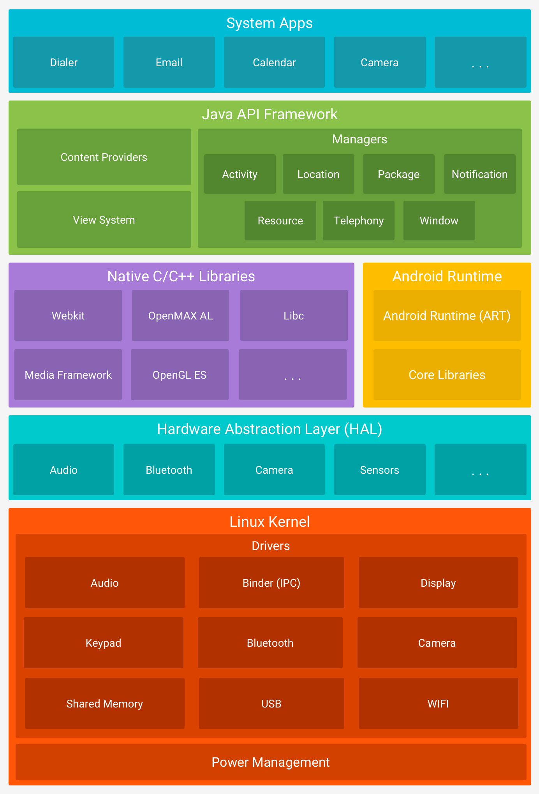

# Platform Architecture

# The Linux Kernel

# Hardware Abstraction Layer (HAL)

The hardware abstraction layer (HAL) provides standard interfaces that expose device hardware capabilities to the higher-level Java API framework. The HAL consists of multiple library modules, each of which implements an interface for a specific type of hardware component, such as the camera or bluetooth module. When a framework API makes a call to access device hardware, the Android system loads the library module for that hardware component.

# Andoird Runtime
For devices running Android version 5.0 (API level 21) or higher, each app runs in its own process and with its own instance of the Android Runtime (ART). ART is written to run multiple virtual machines on low-memory devices by executing DEX files, a bytecode format designed specially for Android that's optimized for minimal memory footprint. Build toolchains, such as Jack, compile Java sources into DEX bytecode, which can run on the Android platform.

Some of the major features of ART include the following:

- Ahead-of-time (AOT) and just-in-time (JIT) compilation
- Optimized garbage collection (GC)
- Better debugging support, including a dedicated sampling profiler, detailed diagnostic exceptions and crash reporting, and the ability to set watchpoints to monitor specific fields

## 关于Android中Dalvik和ART直接的区别
[Android 中的Dalvik和ART是什么，有啥区别?](https://www.jianshu.com/p/58f817d176b7)

# Native C/C++ Libraries
The Android platform provides Java framework APIs to expose the functionality of some of these native libraries to apps. For example, you can access OpenGL ES through the Android framework’s Java OpenGL API to add support for drawing and manipulating 2D and 3D graphics in your app.

If you are developing an app that requires C or C++ code, you can use the Android NDK to access some of these native platform libraries directly from your native code.

# Java API Framework
The entire feature-set of the Android OS is available to you through APIs written in the Java language. These APIs form the building blocks you need to create Android apps by simplifying the reuse of core, modular system components and services, which include the following:

- View System 
- Resource Manager
- Notification Manager
- Activity Manager

# System Apps
Android comes with a set of core apps for email, SMS messaging, calendars, internet browsing, contacts, and more. 

