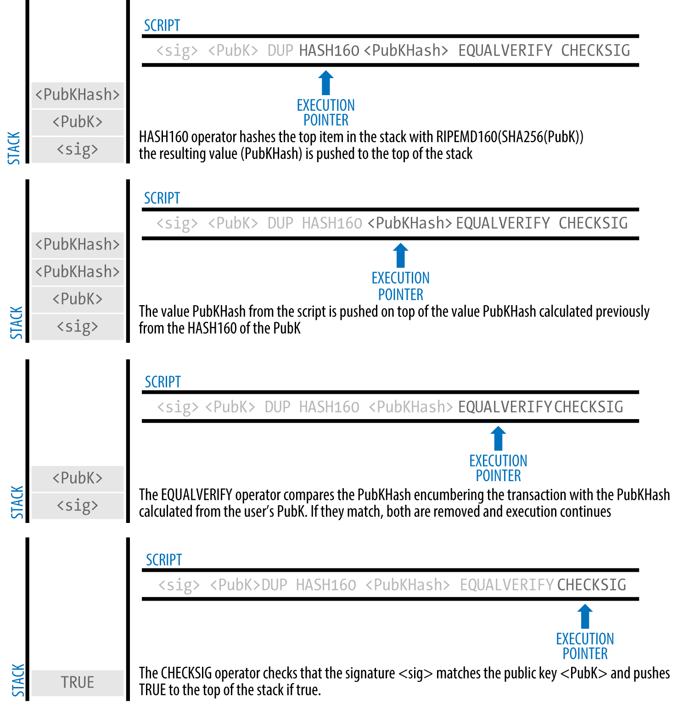
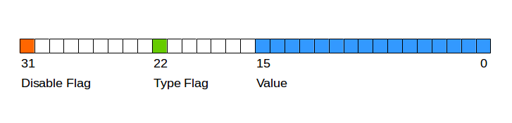

# 摘抄自mastering bitcoin. 记录比特币相关技术重点.
# 交易类型:

unlocking script + locking script

## Pay-to-Public-Key-Hash (P2PKH)
### locking script
```
OP_DUP OP_HASH160 <Cafe Public Key Hash> OP_EQUALVERIFY OP_CHECKSIG
```
### unlocking script
```
<Cafe Signature> <Cafe Public Key>
```
### 验证过程



## Multisignature
Multisignature scripts set a condition where N public keys are recorded in the script and at least M of those must provide signatures to unlock the funds
### locking script
```
M <Public Key 1> <Public Key 2> ... <Public Key N> N CHECKMULTISIG
```
### unlocking script
```
0 <Signature B> <Signature C>
```

## Pay-to-Script-Hash (P2SH)
P2SH was developed to resolve these practical difficulties and to make the use of complex scripts as easy as a payment to a bitcoin address.

解决了多重签名(Multisignature)锁定脚本长度太长的问题.
### Redeem Script
```
2 PubKey1 PubKey2 PubKey3 PubKey4 PubKey5 5 CHECKMULTISIG
```
### Locking Script
```
HASH160 <20-byte hash of redeem script> EQUAL
```
### Unlocking Script
```
Sig1 Sig2 <redeem script>
```
### P2SH Addresses
<20-byte hash of redeem script>  可以当做地址来用.

### Benefits of P2SH
- Complex scripts are replaced by shorter fingerprints in the transaction output, making the transaction smaller.

- Scripts can be coded as an address, so the sender and the sender’s wallet don’t need complex engineering to implement P2SH.

- P2SH shifts the burden of constructing the script to the recipient, not the sender.

- P2SH shifts the burden in data storage for the long script from the output (which is in the UTXO set) to the input (stored on the blockchain).

- P2SH shifts the burden in data storage for the long script from the present time (payment) to a future time (when it is spent).

- P2SH shifts the transaction fee cost of a long script from the sender to the recipient, who has to include the long redeem script to spend it.


## Data Recording Output (RETURN) 数据输出
输出不具备价值, 不能作为UTXO来进行使用

## Timelocks
Timelocks are restrictions on transactions or outputs that only allow spending after a point in time. Bitcoin has had a transaction-level timelock feature from the beginning

### Transaction Locktime (nLocktime)

Transaction locktime is a transaction-level setting (a field in the transaction data structure) that defines the earliest time that a transaction is valid and can be relayed on the network or added to the blockchain.

If nLocktime is nonzero and below 500 million, it is interpreted as a block height, meaning the transaction is not valid and is not relayed or included in the blockchain prior to the specified block height. If it is above 500 million, it is interpreted as a Unix Epoch timestamp (seconds since Jan-1-1970) and the transaction is not valid prior to the specified time

在到达nLocktime前, 这笔钱无法被合并入区块链当中, 所以对于接收方而言非常不可靠.

### Check Lock Time Verify (CLTV)
In December 2015, a new form of timelock was introduced to bitcoin as a soft fork upgrade. Based on a specifications in BIP-65, a new script operator called CHECKLOCKTIMEVERIFY (CLTV) was added to the scripting language. CLTV is a per-output timelock, rather than a per-transaction timelock as is the case with nLocktime. This allows for much greater flexibility in the way timelocks are applied.

### Relative Timelocks
n other words, the clock doesn’t start counting until the UTXO is recorded on the blockchain. This functionality is especially useful in bidirectional state channels and Lightning Networks

### Relative Timelocks with nSequence
The nSequence field was originally intended (but never properly implemented) to allow modification of transactions in the mempool. In that use, a transaction containing inputs with nSequence value below 232 (0xFFFFFFFF) indicated a transaction that was not yet "finalized." Such a transaction would be held in the mempool until it was replaced by another transaction spending the same inputs with a higher nSequence value. Once a transaction was received whose inputs had an nSequence value of 232 it would be considered "finalized" and mined.


The nSequence value is specified in either blocks or seconds, but in a slightly different format than we saw used in nLocktime. A type-flag is used to differentiate between values counting blocks and values counting time in seconds. The type-flag is set in the 23rd least-significant bit (i.e., value 1<<22). If the type-flag is set, then the nSequence value is interpreted as a multiple of 512 seconds. If the type-flag is not set, the nSequence value is interpreted as a number of blocks.

### Relative Timelocks with CSV 
That opcode is CHECKSEQUENCEVERIFY, commonly referred to as CSV for short.


