# 原文链接
[英文原文](https://medium.com/@preethikasireddy/how-does-ethereum-work-anyway-22d1df506369)

[中文翻译(本文主要摘抄自这里, 备份用)](https://mp.weixin.qq.com/s?__biz=MzU2ODQzNzAyNQ==&mid=2247484235&idx=1&sn=f575a7701df76c8a7d7a4d70796373db&chksm=fc8cb305cbfb3a13d9937982baae90afc8f537005bd867ccbca3f0598b11bd3fcb5f5a8d2794#rd)
# 以太坊区块链范式概览
以太坊区块链本质上是一种基于交易的状态机。用专业术语讲，状态机是某种可以读取一系列输入，并会根据这些输入变成新的状态的东西。
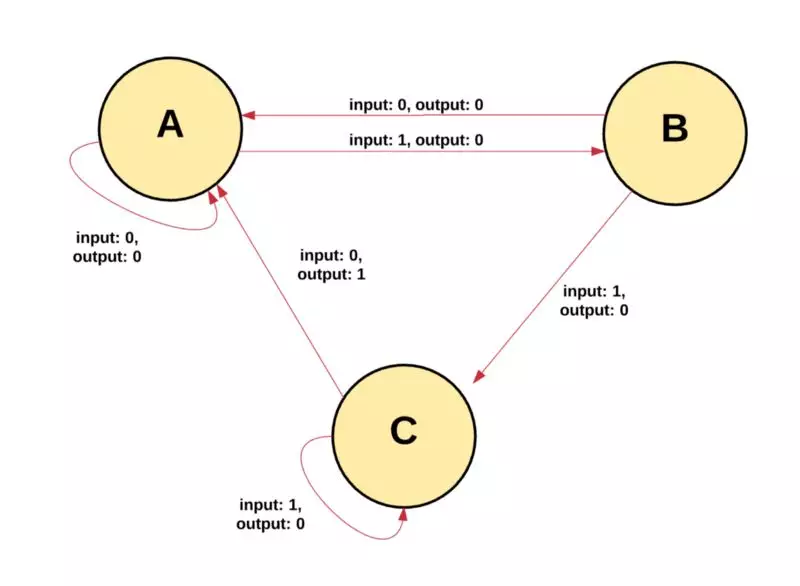

以太坊的状态机是从“创世状态”开始的。处于“创世状态”时，网络中还没有发生过任何交易，就像一张白纸。有交易发生后，这个状态机会从创世状态进入某个最终状态。在任意时刻，以太坊的当前状态就是某个最终状态。

以太坊的状态是由上百万笔交易构成的。这些交易被分组成一个个“区块”。每个区块中都有一系列的交易，并且会跟前一个区块连接在一起。

只有有效的交易才能使状态产生变化。验证交易是否有效的过程被称为挖矿。即会有一些节点（计算机）耗费计算资源来创建包含有效交易的区块。

网络中的所有节点都可以成为矿机，进行区块的创建和验证。在任意时刻，都会有很多来自世界各地的矿机在尝试创建和验证区块。每个矿机在给区块链提交区块时，都会提供一个数学难题的“答案”，这个答案是个保证：如果答案存在，则该区块一定有效。

只有足够快的矿机才能从众多竞争者中脱颖而出，把自己产生的区块添加到区块链中，之后被最多的节点接受。这种让矿机解答数学难题来验证区块的过程被称为“工作证明”。

验证了新区块的矿机会得到一定量的价值回报。这个价值是什么呢？以太坊用的是一种被称为“以太币”（Ether）的内部数字代币。矿机每次提供区块，以太坊都会产生新的以太币并作为回报发给矿机。

不过怎么能保证所有人都会将区块添加到同一个链条上呢？难道没有人想过创建一条自己的区块链吗？

我们之前说区块链是状态共享的交易单例机。依照该定义，正确的当前状态是唯一的全局真相，是所有人都必须接受的。出现多个状态（或链条）会毁了整个系统，因为那样的话，根本不能就哪种状态是正确的达成共识。如果区块链分叉了，那在某个链条上你可能有 10 个以太币，而在另外一条上有 20 个，还有一条上有 40 个。这样是没办法确定哪个链条是最“正统的”。

只要生成了多条路径，就会出现“分叉”。一般来说，我们是想要避免分叉的，因为分叉会扰乱系统，迫使人们在众多链条中选择一条自己相信的。
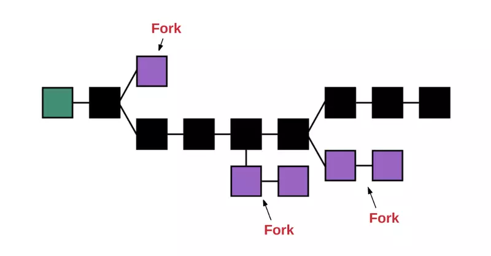

要确定最有效的那条路径并防止出现多个链条，以太坊使用了“GHOST 协议”。

“GHOST” = “贪婪最大权重子树（Greedy Heaviest Observed Subtree）”

简而言之，GHOST 协议是说我们必须选择所做计算最多的那条路径。可以通过比较最新区块（“叶区块”）的区块号来确定哪条路径上的计算量最大，因为它代表了该路径上的区块总数（不含创世块）。区块号越大，说明该路径越长，到达该路径上的叶区块所付出的挖坑工作量也越大。因此可以用这种办法在当前状态的标准版本上达成共识。

在你大致了解区块链是什么之后，我们接下来要介绍一下以太坊系统的主要概念：
- 账户
- 状态
- 燃料与费用
- 交易
- 区块
- 交易执行
- 挖矿
- 工作证明

先说明一下，本文后续提到 X 的“哈希”时，指的是 KECCAK-256 哈希，即以太坊所用的哈希算法。

# 账户
以太坊的全局“共享状态”是由很多个小的对象（“账户”）组成的，这些账户可以通过一个消息传递框架进行协作。每个账户都有一个与之关联的状态和一个 20 字节（160 比特位）的地址，用来标识账户。

账户分为两种：
- 外部拥有账户，由私有秘钥控制，没有关联的代码。
- 合约账户，由合约代码控制，有关联的代码。

## 外部拥有账户 vs. 合约账户
厘清外部拥有账户和合约账户的本质区别很重要。外部拥有账户可以用它的私钥创建和签署交易，从而给其他外部拥有账户或合约账户发送消息。两个外部拥有账户之间的消息仅仅是价值转移。但从外部拥有账户发送给合约账户的消息会激活合约账户的代码，从而执行各种动作（比如传送代币，写入内部存储，铸造新的代币，执行某种计算，创建新的合约等）。

不同于外部拥有账户，合约账户无法自行发起新的交易。只能对自己收到的交易（来自外部拥有账户或其它合约账户）进行响应。后面介绍到“交易与消息”那一节时，我们还要详细介绍合约到合约的调用。
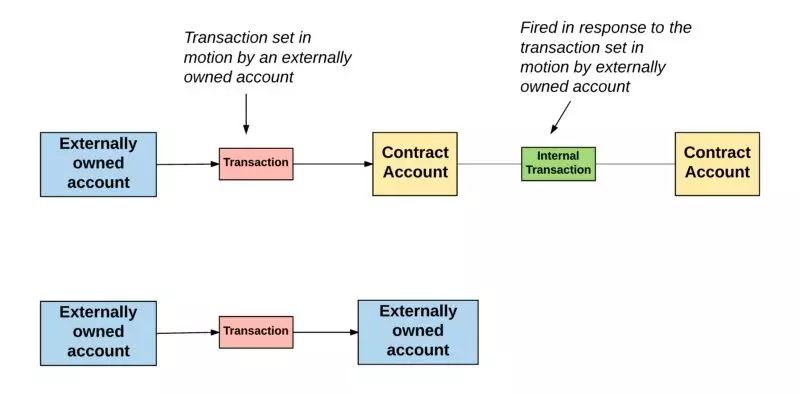

所以以太坊区块链上的所有动作都是由外部控制的账户发起的交易所引发的。
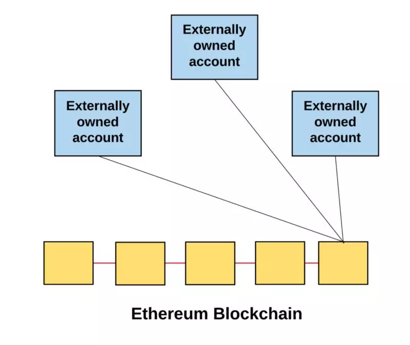

## 账户的状态
不管哪种类型的账户，其状态都是由四个部分组成的：

- nonce: 如果是外部拥有账户，nonce 是从该账户地址发出的交易数量。如果是合约账户，nonce 是该账户创建的合约数量。

- balance: 该地址拥有的 Wei 数。Wei 是以太币的计量单位，一个以太币是 1e+18 Wei。

- storageRoot: 梅克尔帕特里夏树（Merkle Patricia tree）根节点的哈希值（我们稍后再解释什么是梅克尔树）。这个树编码了该账户所存储内容的哈希值，默认为空。

- codeHash: 该账户 EVM（以太坊虚拟机 -Ethereum Virtual Machine）代码的哈希值。对于合约账户而言，会将代码哈希并存储为 codeHash。对于外部拥有账户而言，codeHash 是空字符串的哈希。

## 全局状态
所以说，以太坊的全局状态是由账户地址到账户状态的映射组成的。存储这些映射的数据结构是梅克尔帕特里夏树。

梅克尔树（也称为“梅克尔字典树”）是二叉树的一种，其组成节点包括：
- 树的底部是大量包含底层数据的叶节点。
- 一组中间节点，每个节点的值都是它的两个子节点的哈希。
- 一个根节点，也是由两个子节点的哈希形成的，至此这棵树就到顶了。

我们首先将要存储的数据切分成数据块，作为树的最底层数据。然后将这些数据块分组到不同的数据桶（bucket）中，计算每个数据桶的哈希值。不断重复这一过程，直到哈希值的总数变成一，即直到最终得到根哈希。
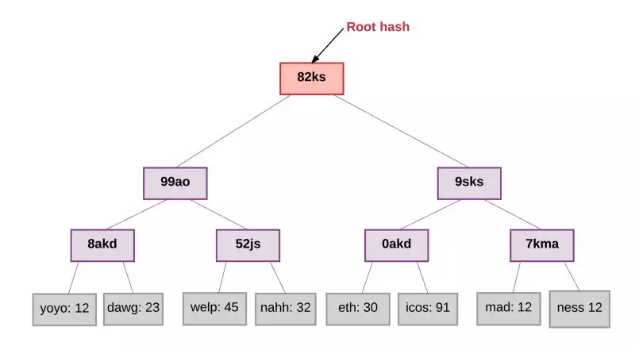

这种树要求给每一个存储在其中的值一个键。从根节点开始，应该能根据键判断出从哪个子节点经过才能到达存储该值的叶子结点。就以太坊而言，状态树的键 / 值映射是地址与相关账户之间的映射，即指向每个账户的 balance、nonce、codeHash 和 storageRoot（而 storageRoot 本身也是一棵树）。

（源自以太坊白皮书）

交易和收据也是用这种字典树结构存储的。具体来说，每个区块都有个“头部”存储三个不同的梅克尔字典树根节点的哈希值，即：
- 状态字典树
- 交易字典树
- 收据字典树

对于以太坊的“轻客户端”或“轻节点”而言，将所有这些信息高效存储在梅克尔字典树中的能力极其重要。维护区块链的节点很多，广义上来讲可以分为全节点和轻节点两类。

全归档节点会保持同步，即将整条区块链都下载下来，从创世块到最新的区块，执行其中的所有交易。一般而言，矿工都是全归档节点，因为这是参与挖矿的必要条件。不过也有可能只是下载，并不执行每一笔交易。不管怎样，只要是全节点，肯定会包含整条区块链。

但除非需要执行所有交易或需要在本地查询历史数据，否则真的没必要存储整条区块链。因此出现了轻节点这个概念，这样的节点只下载区块链的部分数据，虽然还是从创世块到最新块，但只有块的头部，不执行任何交易，也不获取任何相关状态。但因为块头部包含三棵字典树的哈希值，所以要生成和获取与交易、事件、余额等相关的可验证数据也很容易。

这样之所以可行，是因为梅克尔树中的哈希值是向上传递的，如果某个恶意用户要换掉放在梅克尔树底部的某条交易，则其上面的节点都会受影响，即哈希值会发生相应的变化，这种变化最终会传递到根节点上。

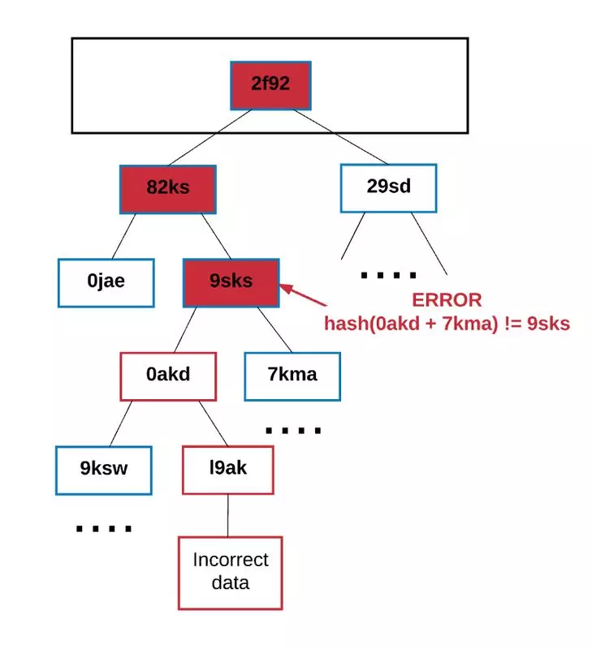

如果想要检验其中的数据，可以使用“梅克尔证据”。梅克尔证据包括：
1. 要验证的数据块及其哈希值。
2. 这棵树的根哈希。
3. 路径枝干（从该数据块到根节点经过的所有上层节点哈希）。
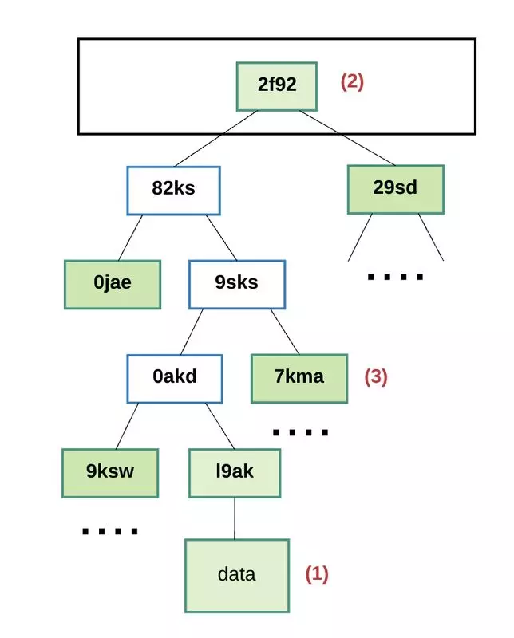
只要能读取这个证据，就可以验证那条路径枝干上的节点是否一致，包括要检验的那个数据块。

综上所述，使用梅克尔帕特里夏树的好处是因为这种结构的根节点在密码学上依赖于树中存储的数据，所以根节点的哈希值可以作为数据的安全标识。既然区块头中包含状态、交易和收据树的根节点哈希，所以说，以太坊网络中的某个节点要验证以太坊状态中的部分数据时，并不需要存储以太坊的所有状态。

# 燃料与支付
费用是以太坊中非常重要的一个概念。以太坊网络中因交易发生的每一次计算都会产生费用。免费？不存在的。费用是按“燃料”支付的。

燃料是为计量特定计算所需费用而设的单位。燃料的价格是你愿意为每单位燃料所支付的以太币，这个价格的单位是“gwei”。“Wei”是以太币的最小单位，1018 个 Wei 是一个以太币，而一 gwei 是 1,000,000,000 Wei。

交易发起方会设定每笔交易的燃料上限和燃料价格，这两个值相乘就是交易发起方愿意为执行这笔交易支付的最高 Wei 数。

比如说，发起方将燃料上限设为 50,000，而燃料价格是 20 gwei。这表明发起方最多愿意为执行这笔交易支付 50,000 x 20 gwei = 1,000,000,000,000,000 Wei = 0.001 以太币。

记住，燃料上限是交易发起方愿意支付的费用的上限。如果他们的账户余额够支付这笔费用，那一切都没问题。在交易结束后，没用掉的燃料会退回给交易发起方，依然按原价兑换成以太币返还。

如果发起方没有提供执行交易所必需的燃料，则该交易会因为“耗光燃料”而失效。此时交易处理终止，发生的状态变化都会回滚，最终回到交易发生前的以太坊状态上。此外，会产生一条交易失败的记录，表明要尝试执行什么交易，以及在哪失败的。不过既然机器在燃料用光之前已经付出了劳动，不把燃料退回给交易发起方也是合理的。

那么花在这些燃料上的钱哪去了呢？发起方用在燃料上的钱都发送给“受益者”地址了，一般来说就是矿机的地址。因为矿机为计算和验证交易做了工作，所以要把燃料费支付给他们作为报酬。

一般来说，发起方愿意支付的燃料价格越高，矿机从交易中得到的回报越高。因此矿机选择交易的可能性也越大。这样矿机可以自由选择要验证或忽略的交易。为了让发起方知道如何设定燃料价格，矿机可以选择将自己愿意执行交易的最低燃料价格广而告之。

## 存储也要收费的
计算需要燃料，存储也需要，存储的费用以 32 字节为一个计价单位。

关于存储费用，有些细节要注意一下。比如说，以太坊状态数据库占用的空间增长时，网络中的所有节点都在同步增长，因此要尽量控制数据量的大小。出于这个原因，如果某个交易中有清除存储记录项的操作，则执行该操作是免费的，并且释放存储空间还能得到退费。

## 为什么要收费？
每一个操作都会影响网络中的所有全节点，这是以太坊的一个重要工作特性。另外，以太坊虚拟机上的计算代价非常高，所以智能合约最好只用来执行简单的任务，比如运行简单的业务逻辑或验证签名或其它加密对象，不要用来做文件存储、发送邮件或机器学习等复杂的事情，否则会给网络带来过大压力。引入收费机制就是为了防止用户过度占用网络资源。

以太坊是完备的图灵机，（简单来说，图灵机就是能模拟任何计算机算法的机器。）允许运行循环计算，因此以太坊也要考虑停机问题（即判断任意一个程序是否能在有限时间内结束运行的问题）。如果不收费，恶意用户在交易内放一个无限循环就可以破坏网络。因此收费也是种保护措施。

那为什么存储也要收费呢？好吧，在以太坊网络中存储数据也是需要成本的，跟计算一样，也是整个网络需要承担的重任。

# 交易和消息
我们之前说过，以太坊是个基于交易的状态机。换句话说，是发生在不同账户之间的交易在推动以太坊全局状态的变化。

从本质上来看，交易是由外部拥有账户生成的一条指令，经过密码学签名，序列化之后提交给区块链。

我们可以把交易分为两种：消息调用 和 合约创建（即会创建一个新的以太坊合约的交易）。

但不管哪种类型的交易，都是由以下部分组成的：
- nonce: 交易发起方所发起的交易数量。
- gasPrice: 交易发起方愿意为执行交易所需的燃料设定的单位价格，计价单位是 Wei。
- gasLimit: 交易发起方愿意为执行交易所支付的燃料的最大值。这笔费用是在计算之前提前设定好并预付出去的。
- to: 交易接收方的地址。如果是合约创建的交易，由于交易创建时还没有合约账户地址，所以会是空值。
- value: 由发起方转到接收方的 Wei 数。在合约创建的交易中，该值是新创建的合约账户的初始余额。
- v, r, s: 用于生成标识交易发起方的签名。
- init (仅用于合约创建交易): 用来初始化新的合约账户的 EVM 代码片段。init 只会运行一次，运行完之后就会被销毁。init 运行后的返回结果是账户代码，这段代码跟合约账户是永久关联的。
- data (只有消息调用才有的可选数据域): 消息调用的输入数据（即参数）。比如说，如果智能合约是用来提供域名注册服务的，则调用该合约时可能需要提供域名和 IP 地址之类的输入数据。
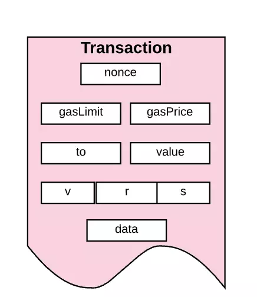

在介绍“账户”时，我们说过，交易总是由外部拥有账户发起并提交到区块链上的。消息调用和合约创建交易都是如此。换个角度想，可以把交易当作是连通外部世界和以太坊内部状态的桥梁。

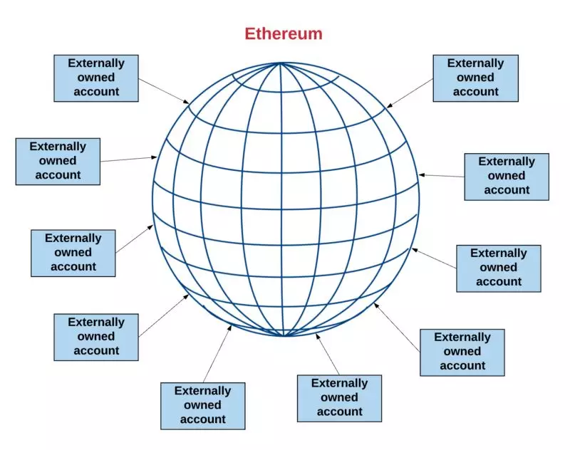

但这并不是说合约不能跟其他合约通话。存在于以太坊状态全局作用域内的合约是可以跟同一作用域下的合约通话。合约账户可以通过“消息”或内部交易通话。我们可以把消息或内部交易当作交易，只是他们不是由外部拥有账户生成的。跟交易不同，他们是虚拟对象，不会被序列化，并且只存在于以太坊的执行环境中。

当一个合约给另一个合约发送内部交易时，在接收方合约账户上的相关代码会运行。
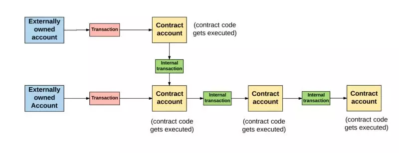
值得注意的是，内部交易或消息没有 gasLimit。因为燃料上限是由创建原始交易的外部账户（即某个外部拥有账户）确定的。外部拥有账户设定的燃料上限必须足以完成交易，包括由此交易引发的子操作，比如合约到合约的消息。如果在此过程中，某条消息将燃料耗光了，则那条消息的执行，以及由执行该消息引发的所有后续消息都会复原。不过其父执行不需要还原。

# 区块
所有交易都会被分到“区块”里。区块链是由一系列这样的区块串起来的。

在以太坊中，区块的构成是：
- 区块头
- 该区块所含交易的相关信息
- 该区块的前辈（Ommer）区块的区块头

## 什么是前辈区块
“前辈区块”是什么鬼？官方的解释是：前辈区块的父区块就是当前区块的父区块的父区块。虽然比较拗口，但我觉得你应该很容易理解，说白了就是跟当前区块的父区块同一辈的区块。这个数据域在之前版本中被称为叔叔（Uncle）区块，后来为了避免出现性别歧视的嫌疑，换成了含义更宽泛的前辈（Ommers）。

接下来我们简单介绍一下前辈区块是干什么用的，以及为什么要保存前辈区块的区块头。

由于采取了不同的构建方式，以太坊 15 秒左右就可以构建一个区块，这比其他区块链快得多，比如比特币需要大约十分钟才能构建一个区块。也就是说，以太坊可以以更快的速度处理交易。但这也有弊端，因为构建时间短，所以找到数学难题解法的矿机就会比较多，形成的竞争区块也多。那些没能变成父区块的竞争区块就可能会被抛弃，变成“孤儿区块”。

引入前辈区块的目的就是为了能给接收孤儿区块的矿机一些回报。矿机接收的前辈区块必须是“有效的”，所谓有效是指这些区块与当前区块的间隔不能超过六代，或者更小。到了第六代子区块之后，就不再保留更老的孤儿区块了（因为那样会有点复杂）。

前辈区块得到的回报比完整区块小。但不管怎样，对于矿机来说，保留这些孤儿区块还是能得到一些好处的。
## 区块头
我们之前说过，每个区块都有个区块“头”，但这个“头”是什么？

区块头是包含如下信息的数据块：
- parentHash: 父区块的区块头的哈希值（这就是把区块连在一起的链条）
- ommersHash: 当前区块的前辈区块列表的哈希值。
- beneficiary: 得到这个区块挖掘费用的账户地址。
- stateRoot: 状态字典树根节点的哈希值（我们之前说过，状态字典树在区块头中，以便于轻客户端对状态进行验证）
- transactionsRoot: 包含本区块中所有交易的字典树的根节点的哈希值。
- receiptsRoot: 包含本区块中所有收据的字典树的根节点的哈希值。
- logsBloom: 由日志信息构成的布隆过滤器（Bloom filter，一种数据结构）
- difficulty: 这个区块的困难等级
- number: 当前区块的号数（创世区块的号数是 0；后续区块逐个加 1）
- gasLimit: 每个区块的燃料上限
- gasUsed: 该区块中所有交易所用燃料的总和
- timestamp: 该区块入链时的 unix 时间戳
- extraData: 与该区块有关的其它数据
- mixHash: 与 nonce 组合使用，证明该区块已经进行了足量的计算
- nonce: 与 mixHash 组合使用，证明该区块已经进行了足量的计算
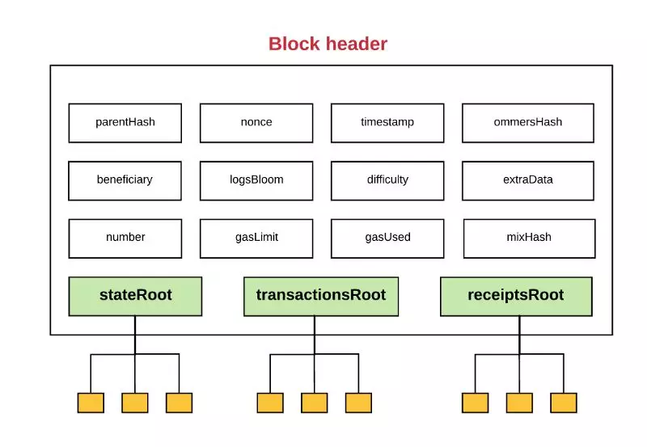

每个区块头中都有三棵字典树，分别用于：
- 状态 (stateRoot)
- 交易 (transactionsRoot)
- 收据 (receiptsRoot)

这些字典树就是我们前面介绍过的梅克尔帕特里夏树。

另外还有几个术语需要再进一步解释一下。

## 日志
我们可以通过以太坊的日志追踪各种交易和消息。合约可以定义“事件”来生成日志。

一条日志包括：
- 记录日志的账户的地址
- 一系列主题，表示由该交易产生的各种事件
- 与这些事件相关的所有数据

日志存储在布隆过滤器中，这是一种高效的日志数据存储方式。

## 交易收据
存放在区块头中的日志来自于交易收据中的日志信息。就像在店里买东西会有收据一样，以太坊也会为每一笔交易生成一个收据。每个收据中都是跟交易有关的一些信息，比如：
- 区块号
- 区块哈希
- 交易哈希
- 当前交易所用的燃料
- 当前交易执行完后当前区块所用燃料的累计量
- 执行当前交易时所创建的日志

等等诸如此类的信息

## 区块难度
区块的“难度”是用来调节区块验证时长的。创世区块的难度是 131,072（2 的 17 次幂），随后每个区块的难度都是用一个特殊的公式计算得出的。如果某个区块的验证时间比前一个区块短，那以太坊协议就会增加这个区块的难度。

区块的难度会影响 nonce，这是在挖掘区块时必须用工作证明算法进行计算的哈希值。

区块的难度和 nonce 之间的数学关系是：
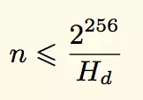
其中 Hd 是难度。

要找到满足难度阈要求的 nonce，只能用工作证明算法去遍历所有可能的值。找到答案的预计时长是跟难度成正比的，难度阈值越高，寻找 nonce 越困难，因此验证区块也越困难。所以可以通过调整区块的难度来调节区块验证所需的时长。

如果情况相反，验证过程变慢了，协议就会降低难度。这样就可以通过自我调节将时长维持在一个稳定的水平上，即每个区块都在 15 秒左右。

# 交易执行
交易执行是以太坊协议中最复杂的部分。从你把一条交易发送到以太坊网络中，到这条交易被纳入以太坊的状态中，在这一过程里，究竟发生了什么？

首先，只有符合要求的交易才能得以执行。这些要求包括：
- 数据格式必须是正确的 RLP。“PLP”是递归长度前缀（Recursive Length Prefix）的缩写，这是一种编码二进制嵌入数组的数据格式。以太坊用 RLP 序列化对象。
- 交易签名有效
- 交易 nonce 有效。账户的 nonce 是发送的交易数，交易的 nonce 必须等于发送账户的 nonce 才是有效的。
- 交易的燃料上限必须大于等于交易所消耗的固有成本。所谓固有成本，包括：
    1. 执行交易的预定义成本 21,000 份燃料
    2. 随交易发送的数据的燃料费（不管数据还是代码，值为 0 时，每个字节 4 份燃料，非 0 时每字节 68 份燃料）
    3. 如果是合约创建的交易，还需要额外支付 32,000 份燃料

交易发起方的账户余额必须足以覆盖包含燃料开支在内的“预付款”。“预付款”的计算很简单：首先用交易的燃料上限乘以燃料价格，确定燃料最高开支。然后将这个燃料开支加上要从发起方发给接收方的总额。

如果交易符合上述所有要求，则执行下一步。

首先从发起方的余额中扣除“预付款”，然后给发起方的 nonce 加 1，以对当前交易计数。这时候，我们可以用燃料上限总额减去固有成本，剩下的就是剩余燃料。

接下来交易开始执行。在交易执行过程中，以太坊会一直追踪“子状态”。以太坊用子状态这种方式记录交易期间累计的记录信息，以便在交易完成后使用。具体来讲，子状态包括：
- 自毁集：交易完成后马上销毁的一组账户（如果有的话）。
- 日志序列：归档的虚拟机代码执行可索引检查点。
- 退款额：交易完成后退还给发起方账户的以太币额度。我们之前说过，以太坊中的存储也是要收费的，如果发起方清退了存储空间，也能得到退款。以太坊用退款计数器来追踪这一信息，其初始值为 0，合约每次执行删除操作时，该值都会增长。

接下来执行处理交易所需的各种计算。

一旦交易要求的所有步骤都做完，并且没有出现无效状态，在确定完要退回给发起方的燃料后，状态就最终确定下来了。除了没用掉的燃料，发起方还能从上面提到的“退款额”那里得到一些退款。

发起方得到退款后：
- 将燃料按以太币支付给矿机
- 交易用掉的燃料加到区块燃料计数器上（追踪区块中所有交易用掉的燃料，在验证区块时要用）
- 如果自毁集中有账户，则全部销毁。

最后，以太坊进入了新的状态，还有一组由交易创建的日志。

交易的执行过程基本就是这样，接下来我们看看合约创建交易跟消息调用之间有什么差别。

## 合约创建
以太坊中有两种账户：合约账户和外部拥有账户。如果说一条交易是“合约创建”的，意思就是这条交易的目的是要创建一个新的合约账户。

为了创建新的合约账户，首先要用一个特殊的公式声明新账户的地址。然后初始化这个账户：
- 将 nonce 设为 0
- 如果发起方要在这条交易中发送以太币，则将账户余额设为相应的以太币值
- 从发起方的余额中扣除掉相应的以太币值。
- 将存储设为空
- 将合约的 codeHash 设为空字符串的哈希值

之后就可以用随着交易发送的 init 代码真正创建这个账户了。执行 init 代码期间发生什么取决于合约的构造器，它可能会更新账户的存储，创建其它合约账户，发起其它消息调用等。

执行合约初始化的代码要用燃料，但所用燃料不能超过剩余燃料。如果超出，会触发燃料耗尽（OOG）异常并退出。如果交易因燃料耗尽异常退出，则立即回退到交易之前的状态。但因为燃料已经用光了，所以不会有燃料退回给交易发起方。

不过交易中作为价值转移部分要发送给接收方的以太币是会退回给发起方的。

如果初始化代码成功完成，要支付一笔最终合约创建费。这是存储费用，跟所创建的合约的代码大小成正比。如果剩余的燃料不足以支付这笔最终费用，交易仍然会触发燃料耗尽异常并放弃。

如果一切正常，剩下没用的燃料全都会退回给交易的最初发起方，并可以持久化保存新的状态！

至此则大功告成！

## 消息调用
消息调用跟合约创建大同小异。

因为不需要创建新账户，所以消息调用没有任何初始化代码。但如果交易发起方有提供的话，它可以包含输入数据。一旦执行，消息调用还可以有包含输出数据的额外组件，供后续执行使用。

跟合约创建一样，如果消息调用因为燃料耗尽或交易无效（比如堆栈溢出、无效的跳转目标或无效的指令）而退出，用掉的燃料不会退还给最初的调用者。相反，所有剩余燃料都会被消费掉，状态也会立即重置为余额转移之前的样子。

在以前，在耗光你所提供的燃料之前，是不能停止或回退交易的执行的。比如说，你创建了一个合约，在调用者没有权限执行某一交易时抛出错误。在以太坊之前的版本中，剩余的燃料仍然会被消耗掉，不会退回给交易发起方。但在拜占庭更新之后，加入了“回退”代码，可以让合约停止执行，回退状态变化，同时不再消耗剩余的燃料，并且能够返回交易失败的原因。如果交易是因为回退才退出的，没用掉的燃料会返还给交易发起方。

## 执行模型
我们前面介绍了交易从开始到结束所要执行的步骤，接下来我们要看一看交易在 VM 中究竟是如何执行的。

真正处理交易的是以太坊自己的虚拟机，称为以太坊虚拟机（Ethereum Virtual Machine，EVM）。

EVM 是图灵完备的虚拟机，它与传统的图灵机之间唯一的差别是添加了燃料限制机制。也就是说它所做的计算总量是受限于交易发起方所提供的燃料总量的。

另外，EVM 是堆栈架构，用后进先出堆栈保存中间值。EVM 中每个栈条目的大小是 256 位，最多可以有 1024 个条目。EVM 有易失性的内存，用字寻址字节数组存储数据。EVM 也有存储，可以永久存储数据，作为系统状态的一部分。EVM 的程序代码是单独存储的，放在只能通过特殊指令访问的虚拟 ROM 中，而传统的冯诺依曼架构是把程序代码放在内存和存储中的。
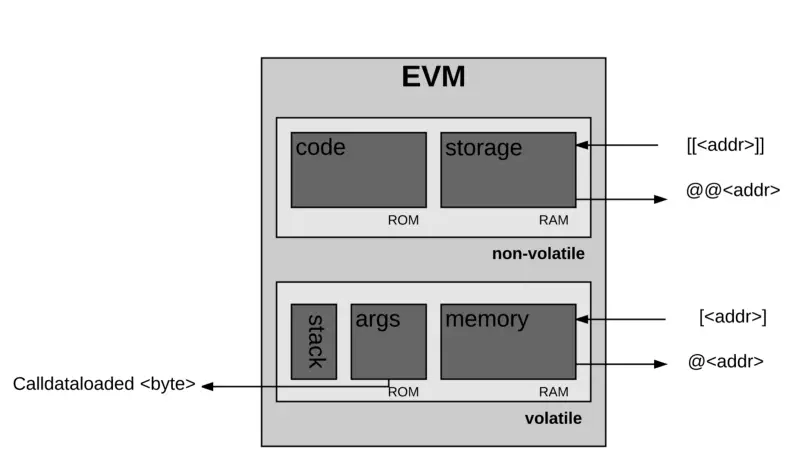

EVM 也有自己的语言：“EVM 字节码”。不过在编写智能合约时，我们一般用 Solidity 之类的高级语言，然后再编译成 EVM 能够理解的 EVM 字节码。

好了，基础知识就介绍到这里，接下来讲交易的执行。

在执行特定计算之前，处理器要确保能访问到下面这些信息，并且都是有效的：
- 系统状态
- 用于计算的剩余燃料
- 拥有正在执行的代码的账户地址
- 触发此次执行的交易发起方的地址
- 引发代码执行的账户地址（可能不是最初的交易发起方）
- 交易的燃料价格
- 此次执行的输入数据
- 作为当前执行的一部分传给这个账户的价值（单位为 Wei）
- 要执行的机器码
- 当前块的区块头
- 消息调用或合约创建的堆栈的深度

在刚开始执行时，内存和堆栈都是空的，程序计数器是 0。

PC: 0 STACK: [] MEM: [], STORAGE: {}

接下来 EVM 开始递归执行交易，在每一次循环中计算系统状态和机器状态。系统状态就是以太坊的全局状态，而机器状态包括：
- 可用的燃料
- 程序计数器
- 内存中存储的内容
- 内存中的活跃字节数
- 堆栈中的内容
- 从最左侧添加或移除出堆栈的条目

在每一次循环中，都会从剩余燃料中扣除一定量的燃料，程序计数器也会增长。循环结束时，有三种可能：
- 机器进入异常状态（比如燃料不足、无效指令、堆栈条目不足、堆栈条目超过 1024 导致溢出、无效的 JUMP/JUMPI 目标等），因此必须停机，所有变化都要撤销。
- 继续处理指令序列，进入下一个循环
- 机器进入受控停机状态（执行过程结束）

如果执行过程没有出现异常，进入了“受控”或正常停机状态，则机器会生成一个最终状态、此次执行后剩余的燃料、应计的子状态、最终输出。

好了，以太坊中最复杂的部分就是这样，即便没全搞明白也没关系。除非做的是非常底层的工作，否则你真的没必要把那些犄角旮旯里的执行细节都搞清楚。

## 区块的最终确定
最后，我们来看一下包含多笔交易的区块最终是如何确定下来的。

我们说的“最终确定”有两层意思，分别对应新区块和已有区块。如果是新区块，指的是挖掘这个区块的过程。如果是已有区块，则是指验证这个区块的过程。不管是哪种情况，要“最终确定”一个区块都需要符合四点要求：

1) 验证前辈区块（挖矿时是确定）

区块头内的所有前辈区块都必须是有效的头部，并且与当前区块的关系要在六代以内。

2) 验证交易（挖矿时是确定）

区块内 gasUsed 的值必须跟区块内所列交易所用燃料的累计值相等。（我们之前介绍过，交易执行时会追踪区块燃料计数器，即追踪区块内所有交易所用燃料的总量）。

3) 兑现回报（仅在挖矿时）

受益地址会因为挖出区块得到 5 个以太币的回报，不过按照以太坊提案 EIP-649 来看，应该很快会降到 3 个以太币。此外，对于每个前辈区块，还会有当前区块 1/32 的额外回报。最后，前辈区块的受益地址也会得到一定量的回报（有一个公式专门用来计算回报额度）。

4) 验证状态和 nonce（挖矿时是确定）

确保所有交易和最终状态的变化都是可行的，并在回报兑现之后将新区块定义为最终状态。要验证最终状态时，只需要检查保存在区块头中的状态字典树就可以了。

# 挖掘工作证明
在讲“区块”那一节时，我们简单介绍了区块难度的概念。赋予区块难度意义的算法被称为工作证明（Proof of Work ，PoW）。

以太坊的工作证明算法是“Ethash”，之前叫匕首 - 桥本（Dagger-Hashimoto）。该算法的正式定义是：

其中 m 是 mixHash，n 是 nonce，Hn 是新区块的头（不含尚未计算出来的 nonce 和 mixHash）H n 是区块头的 nonce，d 是 DAG，这是一个比较大的数据集。

你可能还记得，区块头中有 mixHash 和 nonce 两个数据域：
- mixHash: 与 nonce 组合使用，证明该区块已经进行了足量的计算
- nonce: 与 mixHash 组合使用，证明该区块已经进行了足量的计算

PoW 函数就是用来计算这两个数据域的。不过具体计算过程有点复杂，我们就不展开讨论了，大致过程如下：

首先会为每个区块算出一个“种子”，这个种子会随“纪元”变化（30,000 个区块一个纪元）。在第一个纪元时，种子是 32 字节的 0 的哈希值。在后续每个纪元中，种子都是前一纪元的种子的哈希值。挖矿的节点可以用这个种子计算出一个伪随机的“缓存”。

这个缓存能发挥巨大作用，正是它使“轻节点”成为可能。我们之前说过，轻节点无需存储整个区块链的数据就能验证交易。靠的就是这个缓存，因为这个缓存能重新生成需要验证的区块。

节点可以用这个缓存生成 DAG“数据集”，数据集中的每个条目都依赖于缓存中少量的伪随机选择条目。要想做矿机，必须生成这个完整的数据集，所有的全客户端和矿机都会存储这个数据集，并且这个数据集的大小是随时间线性增长的。

随后矿机可以随机截取这个数据集中的片段，通过一个数学函数计算这些片段的哈希值，生成“mixHash”。矿机会重复生成 mixHash，直到输出小于想要的目标 nonce。当输出满足这一要求时，就可以认为 nonce 是有效的，区块也可以添加到区块链上。

## 挖矿是安全保证
总体而言，PoW 的目的是用加密学的方式证明已经用了一定量的计算来生成了输出（及 nonce）。因为除了遍历所有的可能值，没有更好的办法来满足所要求的阈值。对输出不断地使用哈希函数可以形成均匀的分布，因此可以保证，找到这样一个 nonce 所需的时间取决于难度阈值。难度阈值越大，找到 nonce 的时间越长。就是这样，PoW 算法让难度的概念有了实际的意义，从而加强了区块链的安全性。

在谈到区块链的安全性时，我们谈的是什么？很简单，是说我们要创建一个所有人都相信的区块链。我们之前说过，如果不止一条链，用户将会失去信任，因为他们没办法确定哪个才是“正统”链。要想让大家接受存储在区块链中的状态，那作为正统的区块链必须是唯一的。

而这正是 PoW 算法要做的事情：它能确保目前作为正统的区块链将来依然是正统，攻击者如果想用假交易替换掉真正的交易，必须创建新块改写历史，这几乎是不可能完成的任务；维护分支链同样困难。要想让自己的块第一个通过验证，攻击者必须总是网络中最快算出 nonce 的那个人，这样网络才会相信他的那条链是最重的（基于 GHOST 原则）。然而除非攻击者拥有网络中超过一半的算力，即能发起 51% 攻击，否则这是不可能的。
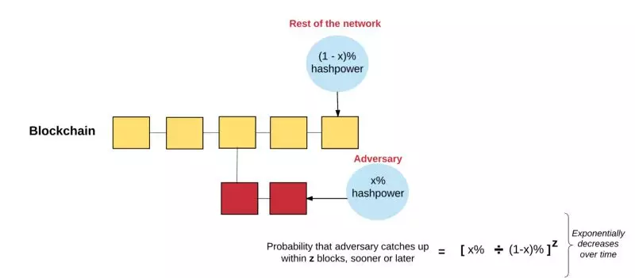

## 挖矿是分钱手段
除了能够保证区块链的安全，PoW 还是一种财富分配机制，让那些付出算力来保证安全的人能得到回报。挖出区块的矿机会收到如下回报：
- 挖出“获胜”区块的矿机得到定额为 5 以太币的回报（很快会变成 3 以太币）。
- 区块内所含交易消耗的成本。
- 引入前辈区块还能得到额外回报。

为了确保 PoW 共识机制能够长期持续，以太坊坚持做到如下两点：
- 尽可能做到阳光普照。换句话说，不需要专门或特殊的硬件来运行这个算法。这样才能让这个财富分配模型尽可能的开放，只要提供算力，不管多少，都有可能得到回报。
- 降低任何单一节点（或小部分节点）获取高额利益的可能。如果某个节点能获取不成比例的高额回报，说明这个节点对确定正统区块链的影响力也会比较大。这会降低网络的整体安全性，因此这是我们不想见到的局面。

在比特币区块链网络中出现了跟上述两点相关的问题，因为它的 PoW 算法是 SHA256 哈希函数。这种函数有个问题，专门的硬件（ASIC）对此有极高的运算效率。

为了规避这个问题，以太坊故意将 PoW 算法（Ethhash）做成了线性内存困难（sequentially memory-hard）的。也就是说用这个算法计算 nonce 需要大量的内存和带宽。这样计算机就很难并行使用内存，同时找到多个 nonce 很难，与此同时，对带宽的高要求也使得高速计算机也不能同时找出多个 nonce。这样就降低了中心化的风险，从而为进行验证的节点创建了更加公平的竞争环境。

这里要提一下，以太坊正在考虑将 PoW 共识机制换成“权益证明（proof-of-stake）”。这个要说起来话就长了，我们先不展开讲了。
